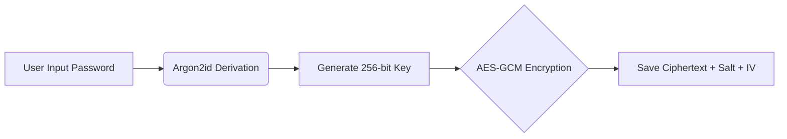

<div align="center">

# 🔐 SafeVault
### Privacy-First Local Secret Manager

[](https://opensource.org/licenses/MIT)
[](https://github.com/dazep01/safevault)
[](#)
[](#)
[](#)

**Simpan rahasia Anda dengan aman. Tanpa server. Tanpa pelacakan.**

[](https://dazep01.github.io/safevault/)
[](https://github.com/dazep01/safevault)

</div>

---

## 📖 Tentang Proyek
**SafeVault** adalah solusi manajemen rahasia (password, API keys, catatan sensitif) yang berjalan sepenuhnya di sisi klien (*client-side*). Mengusung pendekatan **Zero-Knowledge Architecture**, data Anda tidak pernah meninggalkan browser Anda—bahkan kami tidak memiliki server untuk menampungnya.

### ✨ Fitur Utama
*   🚀 **Instant Access**: Berjalan langsung di browser tanpa instalasi backend.
*   🔒 **Military-Grade Encryption**: Menggunakan standar AES-256-GCM.
*   📱 **Offline First**: Progressive Web App (PWA) yang berfungsi tanpa internet.
*   🎨 **Adaptive UI**: Tampilan modern yang mendukung mode Gelap/Terang secara otomatis.

---

## 🛠️ Spesifikasi Teknis
Bagi para pengembang dan auditor keamanan, berikut adalah rincian teknis mengenai bagaimana SafeVault menangani data sensitif Anda:

| Komponen | Teknologi | Detail Implementasi |
| :--- | :--- | :--- |
| **KDF** | `Argon2id` | Iterations: 3, Memory: 64MB, Parallelism: 4 (via `argon2-browser`). |
| **Enkripsi** | `AES-256-GCM` | Menggunakan Initialization Vector (IV) 12-byte unik per entri. |
| **Storage** | `IndexedDB` | Penyimpanan asinkronus terisolasi dalam origin browser. |
| **Environment** | `PWA / SW` | Strategi Cache-First untuk performa offline maksimal. |
| **UI Engine** | `Vanilla CSS` | Menggunakan CSS Variables untuk tema adaptif. |

---

## 🛡️ Protokol Keamanan

> [!IMPORTANT]
> **Zero-Knowledge Architecture**
> SafeVault tidak memiliki database backend. Semua proses enkripsi dan dekripsi terjadi di dalam memori RAM browser Anda. Kunci enkripsi diturunkan dari Master Password dan tidak pernah disimpan secara permanen.
> [!WARNING]
> **Tanggung Jawab Pengguna**
> *   **Lupa Password**: Jika Anda lupa Master Password, data **TIDAK DAPAT** dipulihkan.
> *   **Pembersihan Browser**: Menghapus "Site Data" atau "Clear History" akan menghapus seluruh isi Vault.
> *   **Backup**: Selalu lakukan **Export Backup** secara rutin dan simpan di tempat aman.

### ⚙️ Alur Kerja Enkripsi


---

## 🚀 Instalasi & Penggunaan

### 1. Penggunaan Langsung (Production)
Akses versi stabil terbaru tanpa perlu instalasi:
👉 **[https://dazep01.github.io/safevault/](https://dazep01.github.io/safevault/)**

### 2. Setup Development
Jalankan proyek ini secara lokal untuk pengembangan atau audit kode.

```bash
# 1. Clone repositori
git clone https://github.com/dazep01/safevault.git

# 2. Masuk ke direktori proyek
cd safevault

# 3. Jalankan server lokal (Python 3.x)
python -m http.server 8080

# 4. Buka browser
# Akses http://localhost:8080
```

---

## 📂 Struktur Direktori
```text
safevault/
├── css/                # Styling (iOS-style & Recovery UI)
├── script/
│   ├── sw.js           # Service Worker untuk akses Offline
│   └── script.js       # Core Logic & Cryptography
├── manifest.json       # Metadata untuk instalasi PWA
└── index.html          # Single Page Application entry
```

---

## 📄 Lisensi & Kontribusi
Proyek ini dilindungi di bawah lisensi **MIT**. Kami percaya pada transparansi dan keamanan open-source.

*   **Kontribusi**: Sangat terbuka bagi siapa saja yang ingin meningkatkan keamanan atau UI/UX.
*   **Bug Report**: Silakan buka *Issue* untuk diskusi sebelum mengajukan *Pull Request*.

<div align="center">

**SafeVault — Keep it secret, keep it local.**

[](https://github.com/dazep01/safevault)
[](https://github.com/dazep01/safevault)

</div>
